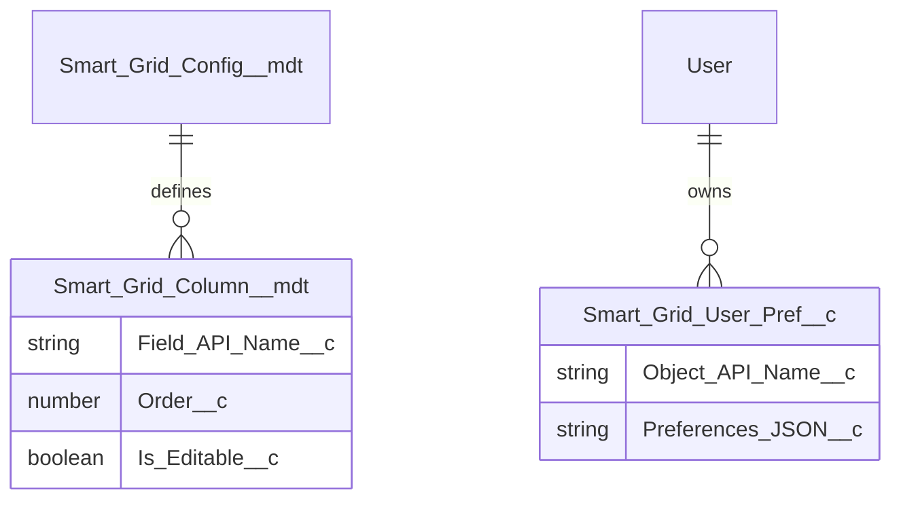

# Data Model: Phase 1 - Grid Lite

## Entity Relationship Diagram

## Field Definitions

### Smart_Grid_Column\_\_mdt (Child)

- **Smart_Grid_Config\_\_c**: MetadataRelationship (Parent Config)
- **Field_API_Name\_\_c**: Text(80)
- **Order\_\_c**: Number(18, 0)
- **Is_Editable\_\_c**: Checkbox
- **Column_Width\_\_c**: Number(18,0)
- **Is_Sortable\_\_c**: Checkbox

### Smart_Grid_User_Pref\_\_c (Custom Object)

- **User\_\_c**: Lookup(User) - OWD Private
- **Object_API_Name\_\_c**: Text(80)
- **Preferences_JSON\_\_c**: LongTextArea(32000)
