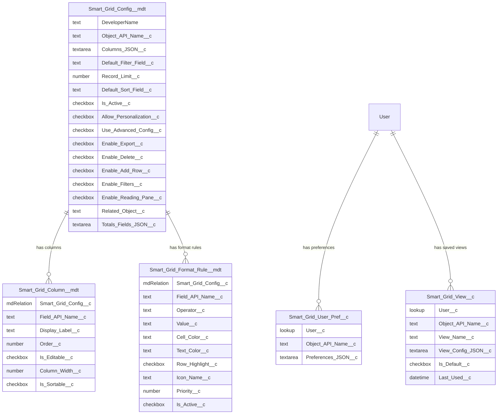

# Data Model: Phase 2 — Smart Grid Pro

**Feature**: 003-smartgrid-phase2
**Date**: 2026-04-21

---

## Entity Relationship Diagram



---

## New: Smart_Grid_Format_Rule\_\_mdt

**Type**: Custom Metadata Type
**Label**: Smart Grid Format Rule
**Plural Label**: Smart Grid Format Rules
**Description**: Defines conditional formatting rules for Smart Grid cell/row highlighting.
**Visibility**: Public

### Fields

| Field API Name         | Label                 | Type                 | Length | Required | Default   | Description                                                           |
| ---------------------- | --------------------- | -------------------- | ------ | -------- | --------- | --------------------------------------------------------------------- |
| `Smart_Grid_Config__c` | Smart Grid Config     | MetadataRelationship | —      | ✅       | —         | Parent config this rule belongs to                                    |
| `Field_API_Name__c`    | Field API Name        | Text                 | 80     | ✅       | —         | The field to evaluate against                                         |
| `Operator__c`          | Operator              | Text                 | 20     | ✅       | —         | `EQUALS`, `NOT_EQUALS`, `GREATER_THAN`, `LESS_THAN`, `CONTAINS`, `IN` |
| `Value__c`             | Value                 | Text                 | 255    | ✅       | —         | Comparison value (comma-separated for `IN`)                           |
| `Cell_Color__c`        | Cell Background Color | Text                 | 7      | ❌       | —         | Hex color (e.g., `#FF0000`)                                           |
| `Text_Color__c`        | Text Color            | Text                 | 7      | ❌       | `#000000` | Hex color for text                                                    |
| `Row_Highlight__c`     | Highlight Entire Row  | Checkbox             | —      | ❌       | `false`   | If true, applies color to the whole row                               |
| `Icon_Name__c`         | Icon Name             | Text                 | 80     | ❌       | —         | SLDS icon (e.g., `utility:warning`)                                   |
| `Priority__c`          | Priority              | Number               | 4,0    | ❌       | `100`     | Lower = higher priority                                               |
| `Is_Active__c`         | Is Active             | Checkbox             | —      | ❌       | `true`    | Enable/disable rule                                                   |

### Metadata XML Example

```xml
<?xml version="1.0" encoding="UTF-8" ?>
<CustomMetadata xmlns="http://soap.sforce.com/2006/04/metadata">
    <label>Smart Grid Format Rule</label>
    <protected>false</protected>
    <values>
        <field>Smart_Grid_Config__c</field>
        <value xsi:type="xsd:string">Account_Demo_Grid</value>
    </values>
    <values>
        <field>Field_API_Name__c</field>
        <value xsi:type="xsd:string">StageName</value>
    </values>
    <values>
        <field>Operator__c</field>
        <value xsi:type="xsd:string">EQUALS</value>
    </values>
    <values>
        <field>Value__c</field>
        <value xsi:type="xsd:string">Closed Won</value>
    </values>
    <values>
        <field>Cell_Color__c</field>
        <value xsi:type="xsd:string">#22C55E</value>
    </values>
    <values>
        <field>Text_Color__c</field>
        <value xsi:type="xsd:string">#FFFFFF</value>
    </values>
    <values>
        <field>Row_Highlight__c</field>
        <value xsi:type="xsd:boolean">true</value>
    </values>
    <values>
        <field>Priority__c</field>
        <value xsi:type="xsd:double">10</value>
    </values>
    <values>
        <field>Is_Active__c</field>
        <value xsi:type="xsd:boolean">true</value>
    </values>
</CustomMetadata>
```

---

## New: Smart_Grid_View\_\_c

**Type**: Custom Object
**Label**: Smart Grid View
**Plural Label**: Smart Grid Views
**Description**: Stores per-user saved grid configurations (filter, sort, column state).
**Sharing Model**: Private (OWD)
**Name Field**: Auto Number (`SGV-{0000}`)

### Fields

| Field API Name        | Label              | Type           | Length | Required | Default | Description                             |
| --------------------- | ------------------ | -------------- | ------ | -------- | ------- | --------------------------------------- |
| `User__c`             | User               | Lookup(User)   | —      | ✅       | —       | View owner                              |
| `Object_API_Name__c`  | Object API Name    | Text           | 80     | ✅       | —       | Grid object context                     |
| `View_Name__c`        | View Name          | Text           | 80     | ✅       | —       | User-defined name                       |
| `View_Config_JSON__c` | View Configuration | Long Text Area | 32768  | ✅       | —       | Serialized filter + sort + column state |
| `Is_Default__c`       | Is Default         | Checkbox       | —      | ❌       | `false` | Auto-load on grid init                  |
| `Last_Used__c`        | Last Used          | DateTime       | —      | ❌       | —       | LRU timestamp                           |

### Object XML Example

```xml
<?xml version="1.0" encoding="UTF-8" ?>
<CustomObject xmlns="http://soap.sforce.com/2006/04/metadata">
    <actionOverrides />
    <allowInChatterGroups>false</allowInChatterGroups>
    <compactLayoutAssignment>SYSTEM</compactLayoutAssignment>
    <deploymentStatus>Deployed</deploymentStatus>
    <description
  >Stores per-user saved Smart Grid view configurations.</description>
    <enableActivities>false</enableActivities>
    <enableBulkApi>true</enableBulkApi>
    <enableReports>false</enableReports>
    <enableSearch>false</enableSearch>
    <enableSharing>true</enableSharing>
    <enableStreamingApi>false</enableStreamingApi>
    <label>Smart Grid View</label>
    <nameField>
        <displayFormat>SGV-{0000}</displayFormat>
        <label>View Number</label>
        <type>AutoNumber</type>
    </nameField>
    <pluralLabel>Smart Grid Views</pluralLabel>
    <sharingModel>Private</sharingModel>
    <visibility>Public</visibility>
</CustomObject>
```

---

## New: SmartGridChannel (Lightning Message Channel)

**Type**: Lightning Message Channel
**File**: `force-app/main/default/messageChannels/SmartGridChannel.messageChannel-meta.xml`

### Fields

| Field           | Type   | Description                                            |
| --------------- | ------ | ------------------------------------------------------ |
| `recordIds`     | String | Comma-separated selected record IDs                    |
| `objectApiName` | String | Object context                                         |
| `action`        | String | Event type: `selected`, `saved`, `deleted`, `filtered` |
| `payload`       | String | Optional JSON payload                                  |

### XML

```xml
<?xml version="1.0" encoding="UTF-8" ?>
<LightningMessageChannel xmlns="http://soap.sforce.com/2006/04/metadata">
    <masterLabel>Smart Grid Channel</masterLabel>
    <description
  >Cross-component communication channel for Smart Grid events.</description>
    <isExposed>true</isExposed>
    <lightningMessageFields>
        <fieldName>recordIds</fieldName>
        <description>Comma-separated selected record IDs</description>
    </lightningMessageFields>
    <lightningMessageFields>
        <fieldName>objectApiName</fieldName>
        <description>Object API name context</description>
    </lightningMessageFields>
    <lightningMessageFields>
        <fieldName>action</fieldName>
        <description
    >Event type: selected, saved, deleted, filtered</description>
    </lightningMessageFields>
    <lightningMessageFields>
        <fieldName>payload</fieldName>
        <description>Optional JSON payload for additional context</description>
    </lightningMessageFields>
</LightningMessageChannel>
```

---

## Modified: Smart_Grid_Config\_\_mdt (New Fields)

| Field API Name           | Label               | Type                  | Default | Description                          |
| ------------------------ | ------------------- | --------------------- | ------- | ------------------------------------ |
| `Enable_Export__c`       | Enable Export       | Checkbox              | `true`  | Toggle CSV export button             |
| `Enable_Delete__c`       | Enable Delete       | Checkbox              | `true`  | Toggle delete button                 |
| `Enable_Add_Row__c`      | Enable Add Row      | Checkbox              | `true`  | Toggle add row button                |
| `Enable_Filters__c`      | Enable Filters      | Checkbox              | `true`  | Toggle filter panel                  |
| `Enable_Reading_Pane__c` | Enable Reading Pane | Checkbox              | `false` | Toggle reading pane sidebar          |
| `Related_Object__c`      | Related Object      | Text (80)             | —       | Child relationship name for sub-grid |
| `Totals_Fields_JSON__c`  | Totals Fields       | Long Text Area (5000) | —       | JSON array of `{field, aggregate}`   |

### Totals_Fields_JSON\_\_c Example

```json
[
  { "field": "Amount", "aggregate": "SUM" },
  { "field": "Amount", "aggregate": "AVG" },
  { "field": "Probability", "aggregate": "AVG" },
  { "field": "Id", "aggregate": "COUNT" }
]
```

---

## Seed CMDT Records (Phase 2 Deployment)

| Record DeveloperName | Config         | Field         | Operator    | Value         | Cell Color | Text Color | Row? | Priority |
| -------------------- | -------------- | ------------- | ----------- | ------------- | ---------- | ---------- | ---- | -------- |
| `Opp_Closed_Won`     | (configurable) | `StageName`   | `EQUALS`    | `Closed Won`  | `#22C55E`  | `#FFFFFF`  | ✅   | 10       |
| `Opp_Closed_Lost`    | (configurable) | `StageName`   | `EQUALS`    | `Closed Lost` | `#EF4444`  | `#FFFFFF`  | ✅   | 20       |
| `Opp_Low_Amount`     | (configurable) | `Amount`      | `LESS_THAN` | `10000`       | `#F59E0B`  | `#000000`  | ❌   | 30       |
| `Case_Escalated`     | (configurable) | `IsEscalated` | `EQUALS`    | `true`        | `#EF4444`  | `#FFFFFF`  | ✅   | 10       |
| `Lead_Hot`           | (configurable) | `Rating`      | `EQUALS`    | `Hot`         | `#22C55E`  | `#FFFFFF`  | ❌   | 10       |

> **Note**: Seed records reference a parent `Smart_Grid_Config__c` that must be configured per org based on which config records exist. The `Account_Demo_Grid` config already exists and can be used as the default parent.

---

## Permission Set Updates

### SmartGrid_User — New Entries

```xml
<!-- New CMDT access -->
<customMetadataTypeAccesses>
    <enabled>true</enabled>
    <name>Smart_Grid_Format_Rule__mdt</name>
</customMetadataTypeAccesses>

<!-- Smart_Grid_View__c object -->
<objectPermissions>
    <allowCreate>true</allowCreate>
    <allowDelete>true</allowDelete>
    <allowEdit>true</allowEdit>
    <allowRead>true</allowRead>
    <modifyAllRecords>false</modifyAllRecords>
    <object>Smart_Grid_View__c</object>
    <viewAllRecords>false</viewAllRecords>
</objectPermissions>

<!-- Smart_Grid_View__c fields -->
<fieldPermissions>
    <editable>true</editable>
    <field>Smart_Grid_View__c.User__c</field>
    <readable>true</readable>
</fieldPermissions>
<fieldPermissions>
    <editable>true</editable>
    <field>Smart_Grid_View__c.Object_API_Name__c</field>
    <readable>true</readable>
</fieldPermissions>
<fieldPermissions>
    <editable>true</editable>
    <field>Smart_Grid_View__c.View_Name__c</field>
    <readable>true</readable>
</fieldPermissions>
<fieldPermissions>
    <editable>true</editable>
    <field>Smart_Grid_View__c.View_Config_JSON__c</field>
    <readable>true</readable>
</fieldPermissions>
<fieldPermissions>
    <editable>true</editable>
    <field>Smart_Grid_View__c.Is_Default__c</field>
    <readable>true</readable>
</fieldPermissions>
<fieldPermissions>
    <editable>true</editable>
    <field>Smart_Grid_View__c.Last_Used__c</field>
    <readable>true</readable>
</fieldPermissions>

<!-- New Apex classes -->
<classAccesses>
    <enabled>true</enabled>
    <apexClass>SmartGridFormatEngine</apexClass>
</classAccesses>
<classAccesses>
    <enabled>true</enabled>
    <apexClass>SmartGridViewService</apexClass>
</classAccesses>
<classAccesses>
    <enabled>true</enabled>
    <apexClass>SmartGridIdValidator</apexClass>
</classAccesses>
```
